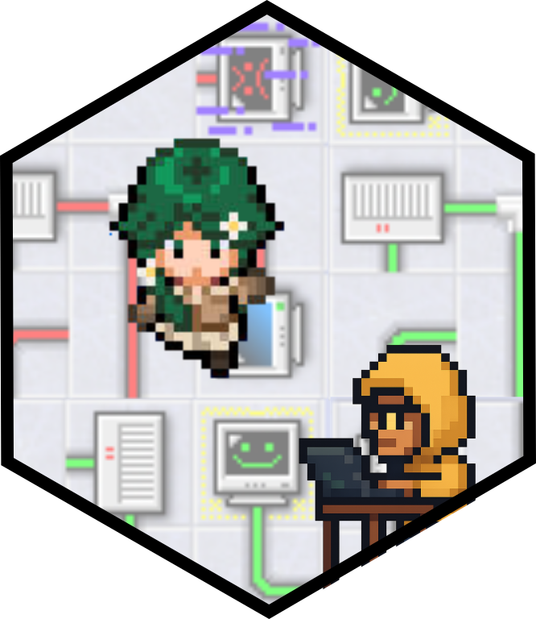
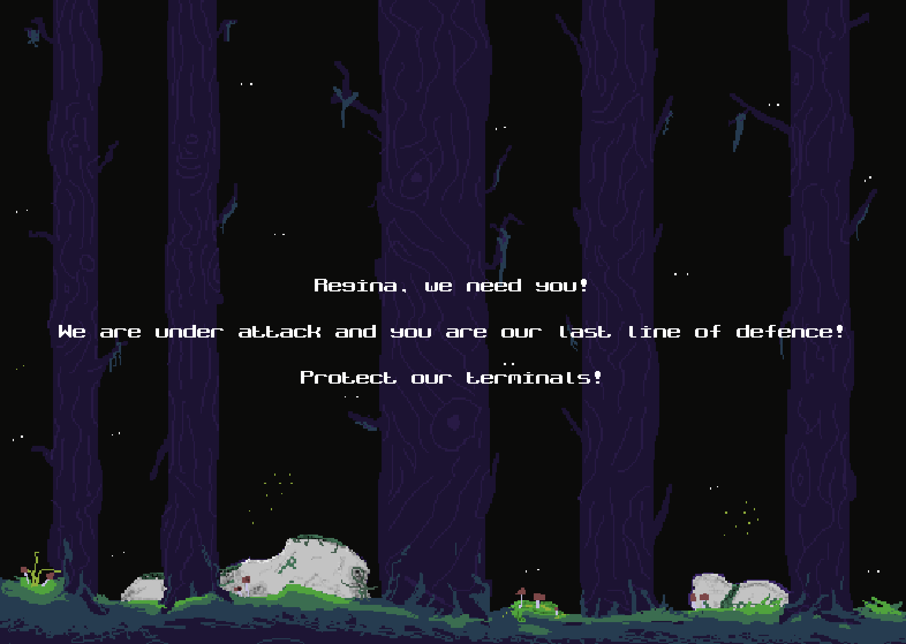

# Regina's Quest



To run the game with [uv](https://docs.astral.sh/uv/):

1. Clone the repo and move to the `reg-game` folder
```
git clone git@github.com:alan-turing-institute/hackweek-retro-gaming.git
cd hackweek-retro-gaming/reg-game
```

2. Create an environment with `uv venv`
```
uv venv
source .venv/bin/activate
```

3. Run `main.py` with `uv run`
```
uv run main.py
```

4. Turn up the sound!

## How to play



- You play as _Regina_ and can move her by using the standard directional keys
- You need to protect the terminals that _Maisy Malware_ will try to attack
- You can stop Maisy for several seconds by trapping her in one of your three sandbox which you can drop using the `space` key
- If Maisy reaches a terminal, you have 10 seconds to reach that terminal and stop the attack
  - If you reach the terminal in time, you play a mini game where you need to connect the two computers by rotating the circuits to create a valid path. You have 15 seconds to do this!
- The game runs for 30 seconds and you need to have a positive score to win
